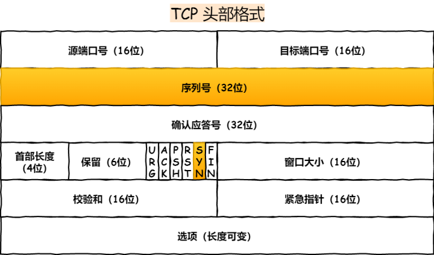

## TCP可靠地关闭

* 保证数据传输完整性
* 对于数据发送方: send()+shutwown(WR)+read()->0+close
* 对于数据接收方： read()->0 + if nothing more to send + close()
* 为了安全起见，shutdown后一般添加一个超时
* 如果协议栈的接受缓冲区还有数据，没有去读，直接close，会导致TCP协议栈发送RST分节，强行的断开连接。如果这时协议栈的发送缓冲区还有数据，对方没有受到，数据就丢失了。close太早，SO_LINGER选项无法解决此类问题
* 总结起来，read返回0再去close，此时read返回0表示EOF，表示close是安全的。
更好的办法是设计协议的时候把长度包含进去。这样接收方能够主动地判断数据是否接收完毕，接收完即可以断开连接

##### TCP是个可靠协议，为什么常见的还要在应用层加个ACK响应

* TCP协议栈的ACK表示对方协议栈已经收到了你的数据，但是并不代表对方应用程序已经处理了你的数据，对方可能已经阻塞了或者死锁了，那么数据还是保存在接受缓冲区里，会给你一个TCP的ACK。应用层看不见这个ACK，所以需要添加一个TCP的ACK

##### SIGPIPE

* 当pipe的另一端被关闭的时候,SIGPIPE会被发送给发送者
* 默认的信号处理是关闭进程,命令行piping是最好的
* unix默认是阻塞IO

##### nagel 算法, TCP_NODELAY

* socket编程里面，发送的难度大于接收
* write-write-read，第2个发送将会延迟一个RRT
* RRT, 往返延迟
* 建议默认把TCP_NODELAY打开

##### sicket中send的普遍执行流程

* send首先比较待发送数据的长度len和套接字s的发送缓冲的长度
* 如果len大于s的发送缓冲区的长度，该函数返回SOCKET_ERROR
* 如果len小于或者等于s的发送缓冲区的长度，那么send先检查协议是否正在发送s的发送缓冲中的数据，就是等待协议把数据发送完
* 如果协议还没有开始发送s的发送缓冲中的数据或者s的发送缓冲中没有数据，那么send就比较s的发送缓冲区的剩余空间和len
* 如果len大于剩余空间大小,send就一直等待协议把s的发送缓冲中的数据发送完
* 如果len小于剩余空间大小,send就仅仅把buf中的数据copy到剩余空间里（注意并不是send把s的发送缓冲中的数据传到连接的另一端的，而是协议传的，send仅仅是把buf中的数据copy到s的发送缓冲区的剩余空间里）
* 如果send函数copy数据成功，就返回实际copy的字节数，如果send在copy数据时出现错误，那么send就返回SOCKET_ERROR
* 如果send在等待协议传送数据时网络断开的话，那么send函数也返回SOCKET_ERROR

##### 不同进程或者线程访问向同一个Socket传递数据(即使用send时),是否会出现数据出错问题

* 需要查看结构体
    ```c++
    struct sockbuf {
        short sb_flags;
        ...
    }so_recv, so_snd;
    ```
    * 其中flag有这几种标志：SB_LOCK，一个进程已经锁定了插口缓存；SO_WAIT, 一个进程正在等待给插口缓存加锁
    * send在向缓冲传送数据之前，首先会对缓冲加锁。通过加锁确保多个进程或者线程按序互斥访问插口缓冲
* 所以说多个线程或者进程向同一个Socket发送数据时，根本不需要再加锁，系统已经为缓冲区加过锁了。

## TCP参数配置以提高整体性能

* TCP协议是由操作系统实现，所以操作系统提供了不少调节TCP的参数

### TCP三次握手的性能提升

* TCP是面向连接的，可靠的，双向传输的传输层通信协议，所以在传输数据之前需要经过三次握手才能建立连接


* 三次握手的过程在一个HTTP请求的平均时间占比10%以上，在网络状态不佳，高并发或者遭遇SYN攻击等场景中，如果不能有效正确的调节三次握手中的参数，就会对性能产生很多的影响。

* 如何正确有效地使用这些参数，来提高TCP三次握手的性能，这就需要理解三次握手的状态变迁，这样当出现问题时，先用netstat命令查看是哪个握手阶段出现了问题，再来对症下药，而不是病急乱投医

##### 客户端优化

* 三次握手建立连接的首要目的是***同步序列号***
* 只有同步了序列号才有可能传输。TCP许多特性都依赖于序列号实现，比如流量控制、丢包重传等，这也是三次握手中的报文称为SYN的原因。
* SYN， synchronize sequence numbers



###### SYN_SENT状态的优化

* 客户端作为主动发起连接方，首先它将发送SYN包，于是客户端的连接就会处于SYN_SENT状态

* 客户端在等待服务端回复的ACK报文，正常情况下，服务器会在几ms内返回SYN+ACK，但是如果客户端长时间没有受到SYN+ACK报文，则会重发SYN包，重发的次数由tcp_syn_retries参数控制，默认是5次

* 通常，第一次超时重传是在1s后，以后每次超时重传间隔是之前时间的2倍。

* 如果5次重传后，仍然服务端没有回应ACK，客户端就会终止三次握手

* 所以总耗时是1+2+4+8+16+32 = 63s,大概是1min左右


* 你可以根据网络的稳定性和目标服务器的繁忙程度修改SYN的重传次数，调整客户端的三次握手时间上限。比如内网中通讯时，就可以适当调低重试次数，尽快把错误暴露给应用程序

##### 服务端优化

* 当服务端收到SYN包后，服务端会立马回复SYN+ACK包，表明确认收到了客户端的序列号，同时也把自己的序列号发给对方

* 此时，服务端出现了新连接，状态时SYN_RECV,在这个状态下，linux内核就会建立一个半连接队列来维护未完成的握手信息，当半连接队列溢出后，服务端就无法再建立新的连接

* SYN攻击，攻击的即iushi这个半连接队列

###### 如何查看由于SYN半连接队列已满，而被丢弃连接的情况？

* 由于半连接队列已满而引发的失败次数查询
```bash
    netstat -s | grep "SYNs to LISTEN"
```

* 要想增大半连接队列，不能只单纯增大tcp_max_syn_backlog的值，还需要一同增大somaxconn和backlog，也就是增大accept队列，否则只是单纯增大tcp_max_syn_backlog是无效的

* 增大tcp_max_syn_backlog和somaxconn的方法是修改linux内核参数
```bash
    echo 1024 > /proc/sys/net/ipv4/tcp_max_syn_backlog
    echo 1024 > /proc/sys/net/core/somaxconn
```

* 增大backlog的方式，每个web服务都不同，在nginx中增大backlog的方法如下：
```bash
    #/usr/local/nginx/conf/nginx.conf
    server {
        listen 8088 default backlog=1024;
        server_name localhost；
        ...
    }
```
* 之后重启nginx幅区即可，因为SYN半连接队列和accept队列都是在listen()初始化的

###### 如果SYN半连接队列已满，只能丢弃连接么？

* 并不是这样，开启syncookies功能就可以在不使用SYN半连接队列的情况下成功建立连接
* syncookies的工作原理：服务器根据当前状态计算出一个值，放在己方发出的SYN+ACK报文中发出，当客户端返回ACK报文时，取出该值验证，如果合法，就认为连接建立成功。


* syncookies参数主要有以下三个值
* 0，表示关闭该功能；1，表示仅仅当SYN半连接队列放不下时，再启用；2，表示无条件启动该功能
* 当客户端接收到服务器发来的SYN+ACK报文后，就会回复ACK给服务器，同时客户端连接状态从SYN_SENT转换为ESTABLISHED，表示连接建立成功
* 当网络繁忙，不稳定时，报文丢失就会变得很严重，此时应该调大重发次数，反之则可以调小重发次数。修改重发次数的方法是，调整tcp_synack_retries参数
* 服务器接收到ACK后连接建立成功，此时内核会把连接从半连接队列移除，然后建立新的完全的连接，并将其添加到accept队列，等待进程调用accept函数时把连接取出来
* 如果进程不能及时地调用accept函数，就会造成accept队列(也成为全连接队列)溢出，最终导致建立好的TCP连接被丢弃

###### accept队列已满，只能丢弃连接么

* 丢弃连接只是linux的默认行为，我们还可以选择向客户端发送RST复位报文，告诉客户端连接已经建立失败。打开这一功能需要将tcp_abort_on_overflow参数设置为1
    * 0，如果accept队列满了，那么server扔掉client发过来的ack
    * 1，如果accept队列满了，server发送一个RST包给client,表示废掉这个握手过程和这个连接

* 通常应该把这个参数设置为0，这样更有利于应对突发流量


###### 如何调整accept队列的长度

* accept队列的长度取决于somaxconn和backlog之间的最小值，也就是min(somaxconn, backlog)

* 如何查看服务端进程accept队列的长度
```bash
    ss -ltn
```
* Recv-Q: 当前accept队列的大小，也就是当前已经完成三次握手并等待服务端accept()的TCP连接

* Send-Q: accept队列最大长度，上面的输出结果说明监听8088端口的TCP服务，accept队列的最大长度是128

###### 如何查看由于accept连接队列已满，而被丢弃的连接
```bash
    netstat -s | grep overflowed
```

##### 如何绕过三次握手

* 三次握手建立连接造成的后果就是，HTTP请求必须在一个RTT(从客户端到服务器一个往返的时间)后才能发送

* 在linux 3.7内核版本之后，提供了tcp fast open功能，这个功能可以减少TCP连接建立的时延

### TCP FAST OPEN功能的工作方式及客户端首次建立连接时的过程


* 客户端发送SYN报文，该报文包含Fast Open选项，且该选项的cookie为空，这表明客户端请求Fast open cookie

* 支持TCP FAST OPEN的服务器生成cookie，并将其置于SYN-ACK数据包中的Fast open选项以发回客户端

* 客户端收到SYN-ACK后，本地缓存fast open选项中的cookie
* 所以第一次发起HTTP GET请求的时候，还是需要正常的三次握手流程，但是之后如果客户端再次向服务器建立连接时的过程

* 客户端发送SYN报文，该报文包含数据(对于非TFO的普通TCP握手过程，SYN报文中不包含数据)以及此前记录的cookie

* 支持TCP Fast Open的服务器会对受到cookie进行校验，如果cookie有效，服务器将在SYN-ACK报文中对SYN和数据进行确认，服务器随后将数据递送至相应的应用程序。如果cookie无效，服务器将丢弃SYN报文中包含的数据，且其随后发出的SYN-ACK报文将只确认SYN的对应序列号

* 如果服务器接受了SYN报文中的数据，服务器可以在握手完成之前发送数据，这样就减少了握手带来的1个RRT的时间消耗

* 客户端将发送ACK确认服务器发回的SYN以及数据，但是如果客户端在初始的SYN报文中发送的数据没有被确认，则客户端将重新发送数据

* 此后的TCP连接的数据传输过程和非TFO的正常情况一致

* 客户端在请求并存储了fast open cookie之后，可以不断重复TCP FAST OPEN直至服务器认为cookie无效，通常为过期

* 在linux系统中，可以通过设置tcp_fastopn内核参数，来打开fast open功能
```bash
    echo 3 > /proc/sys/net/ipv4/tcp_fastopen
```

* 0 关闭；1 作为客户端使用fast open功能； 2 作为服务端使用fast open功能；3 无论作为客户端还是服务端，都可以使用fast open功能

* tcp fast open功能需要客户端和服务端同时支持，才有效果


## 四次挥手的性能提升

* 客户端和服务端双方都可以主动断开连接，通常先关闭的一方称为主动方，后关闭连接的一方称为被动方


* 四次挥手过程只涉及了两种报文，分别时FIN和ACK

* 